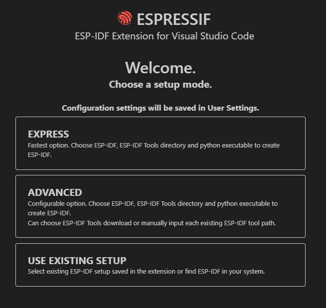
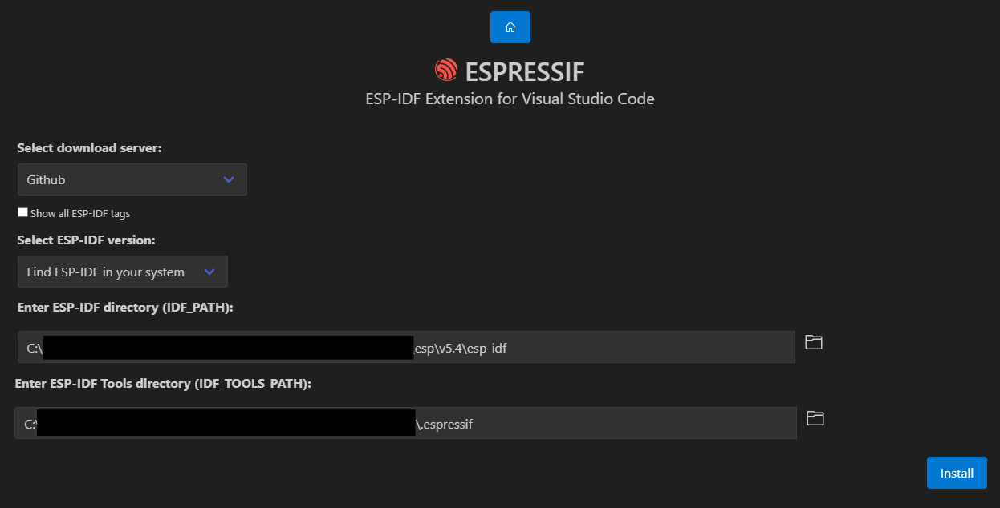

:toc:

= ESP-IDF in VSCode
Kadwalon Lobet, Guillaume de Maricourt.

ESP-IDF is a all-in-one VS Code extension. It allows to build, flash and debug any esp32. +
Documentation goal is to be a walkthrough on how to setup this tool which can be a bit tedious on windows.

WARNING: Other architecture (mac/linux) are not covered by this documentation. +
Please refer to the link:https://docs.espressif.com/projects/vscode-esp-idf-extension/en/latest/installation.html[official documentation].

NOTE: This installation can take quite some times. You should run it when your computer is available for about 10 to 20 minutes.

Before proceeding, we highly recommended that you read the link:https://docs.espressif.com/projects/vscode-esp-idf-extension/en/latest/installation.html[official documentation].

== ESP-IDF extension setup

Open VS Code and add the link:https://marketplace.visualstudio.com/items?itemName=espressif.esp-idf-extension[ESP-IDF extension]. +
Once done the extension will open a pop-up and ask how you'd like to set it up.



=== Default folder installation

Click on ``Express``. This will show a configuration menu with different drop-drown menus and paths designators. +
Select the required SDK version (version used in this project is v5.2.5) and click on ``Install``.


The below path should look like the one displayed below (truncated on purpose). +
If this path don't match the one you like, please refer to this xref:_default_folder_installation[section].



Once done you can jump to this xref:build_and_flash[section].

=== Custom folder installation

Click on ``Express``. This will show a configuration menu with different drop-drown menus and paths designators. +
Select the required SDK version (version used in this project is v.v5.2.5).

The below path should look like the one displayed below (truncated on purpose). +
Select the one you'd like and keep track of its location.

NOTE: The extension might prompt that the required folders don't exist. If not create them and try it again.

WARNING: If you wish to setup sdk using custom folders please make sure that ``esp/`` and ``.espressif/`` folders are in two seperated folders. +
This is mandatory, as specified in official documentation.

Seperated folders example:

- ``X:/[...]/espressif/sdk/esp/``
- ``X:/[...]/espressif/tools/.espressif/``


Once done you can jump to next section.

== Environment variables

ESP-IDF needs some environment variables to work. This is mostly required but quite messy since VS Code also store those variable. +
Your setup might already work (feel free to test) but this section will explain how to cleanly set it up.

Please find your previous folders location (e.g. ``.espressif/`` and ``esp/``).
Once done, create two environments variables (requires elevated privileges):

- ``IDF_PATH`` which points to ``X:/[...]/esp/`` folder.
- ``IDF_TOOLS_PATH`` which points to ``X:/[...]/.espressif/`` folder.

Regardless of wether you have used the defaults folder or not, this step is needed.

Once done open VS Code and run this command strock ``ctrl+maj+p``. Type "Preferences: Open user settings (JSON)". +
Navigate to the end of this file and add the following lines (or replace them, if already set by the extension):

[JSON, title=Required lines]
```
	"idf.pythonInstallPath": "${env:IDF_TOOLS_PATH}\\tools\\idf-python\\3.11.2\\python.exe",
    "idf.espIdfPathWin": "${env:IDF_PATH}\\v5.4\\esp-idf",
    "idf.toolsPathWin": "${env:IDF_TOOLS_PATH}",
    "idf.gitPathWin": "${env:IDF_TOOLS_PATH}\\tools\\idf-git\\2.39.2\\cmd\\git.exe",
    "idf.espIdfPath": "${env:IDF_PATH}",
```

== Adding dependencies C/C++ detection

To add dependencies detection (i.e. includes from sdk) you'll need to edit the C/C\++ extension. +
This extension should have been already downloaded, asked by ESP-IDF extension.

In VS Code run this command strock ``ctrl+maj+p``. Type "C/C++: Edit Configurations (JSON)" +

Add the following line in ``includePath``, ``"${env:IDF_PATH}/**"`` like shown below
[JSON, title=Before adding line]
```
	"includePath": [
		"${workspaceFolder}/**"
	],
```
[JSON, title=After adding line]
```
	"includePath": [
		"${workspaceFolder}/**", // Don't forget the comma here
		"${env:IDF_PATH}/**"
	],
```

== Build and flash

Once those steps are done, try to build the project with:

- Command strock ``ctrl+maj+p``.
- "ESP-IDF: Build your project".

NOTE: VS Code must be open in root project directory

== Errors and issues
If any errors occurs, please make sure you have read all the notes and warnings.

If it persists google the error and try to find a patch. +
Please submit all the patch and issues you have encountered to enhance this documentation and help further users.
