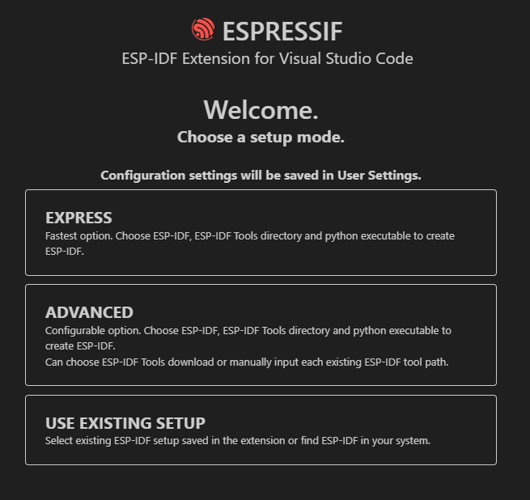

:toc:

= Software toolchain setup
Kadwalon Lobet, Guillaume de Maricourt.

ESP-IDF is a software development kit (SDK) provided by ESP to access all of it's toolchain : debug, flash, build and so on. +
Both installation (VS Code and local) take quite some time.
You should run it when your computer is available for about 10 to 20 minutes.

WARNING: Max and Linux architectures  are not covered by this documentation. +
Please refer to the link:https://docs.espressif.com/projects/vscode-esp-idf-extension/en/latest/installation.html[official documentation].

== Code formatting using uncrustify

Uncrustify is a code formatter. +
Copy link:tools/uncrustify.exe[uncrustify executable] and place into the desired folder.

Open VS Code and run this command strock ``ctrl+maj+p``. +
Type "Preferences: Open user settings (JSON)". +
Navigate to the end of this file and add the following lines (or replace them, if already set by the extension).

[JSON, title=Required lines]
```
    "uncrustify.executablePath.windows": "X:\\path\\to\\uncrustify.exe",
    "uncrustify.configPath.windows": "uncrustify.cfg",
```

You can then setop ``uncrustify`` as your default code formatter for C/C++.

WARNING: You can set uncrustify path pointing to the tools folder. However we strongly advise to not do so because you will lose support once you delete it.

== ESP-IDF setup using default installer

=== Hardware important note
Debug is stable only if you connect IO8 to 3.3V. Please ensure this is done before tester debug.

=== Default setup
First follow the link:https://docs.espressif.com/projects/esp-idf/en/stable/esp32/get-started/windows-setup.html[documentation] for installing this SDK. You can either use the link:https://dl.espressif.com/dl/esp-idf/?idf=4.4[online installer or the offline installer].

==== Troubleshoots
Try to run ``idf.py --help`` in "ESP-IDF CMD" terminal.

If it fails open "ESP-IDF CMD" terminal and go to your installation folder ``X:\[...]\Espressif\frameworks\esp-idf-vX.X``. +
Run ``install.bat`` and then ``export.bat`` which will set python environment and export the path variables.

WARNING: You must open this terminal using admin rights.

=== Build and flash
Create an example project or create yours:

- ``idf.py create-project-from-example ExampleProjectName``
- ``idf.py create-project ProjectName``

In project root directory run : ``idf.py set-target TargetName``. +
If you don't know what to fill for ``TargetName`` run ``idf.py --list-target``.
Run ``idf.py flash``, this will build the project (takes some time first time) and flash the selected target. +
By default ``idf.py flash`` will try to detect the connected target.

==== Troubleshoots
Multiple errors can occur at this step. Below instruction can help you solve them:

- If COM port is not recognized due to a "COM PORT" error, set the COM port using ``idf.py -p PortNumber``.
- If flashing fails, ensure that the project builds. See example projects provided by ESP in their SDK.

=== Debug
You might need to debug your target. Connect a target to your computer, open "ESP-IDF CMD" terminal. +
Run ``idf.py gdbtui`` or ``idf.py gdbgui`` (need to run ``install.bat`` with ``--enable-gdbgui`` option). +
In another terminal run ``idf.py openocd``. +
If any of these steps are not working (i.e. you cant connect using openocd) follow troubleshoot instructions below.

==== Troubleshoots
Due to drivers issues on windows, ESP-IDF can fail to connect to target and debug it.

Open a windows command prompt using elevated privileges and run ``Invoke-WebRequest 'https://dl.espressif.com/dl/idf-env/idf-env.exe' -OutFile .\idf-env.exe; .\idf-env.exe driver install --espressif``. +
Once done restart your computer and test again.

If this step does not solve the issue install link:https://zadig.akeo.ie/[Zadig driver tool]. +
Go to "Options -> List all devices". +
Select target (should be "USB JTAG/serial debug unit (interface X)"). You will see that there is two interfaces for this device.

WARNING: Do not replace the driver named "usbser". This one is used to flash target while the other is use to access debug.

Replace the interface showing a driver *named* "WinUSB". If this version is different than "WinUSB (v.6.X.X.X)" follow the next instructions. +
__Else, you're fucked.__ +
Replace the desired driver with "WinUSB (v.6.X.X.X)". This is a downgrade but it's the point ! +
Once done restart your computer and test again.

NOTE: If, by mistake, you updated the wrong driver you can always reset it with link:https://answers.microsoft.com/en-us/windows/forum/all/uninstalling-a-driver-completely/8b7195cb-0d74-4ddf-ad55-ac0bcbf76f22[this procedure].

== ESP-IDF SDK setup using VS Code
ESP-IDF is a all-in-one VS Code extension. It allows to build, flash and debug any esp32. +
Documentation goal is to be a walkthrough on how to setup this tool which can be a bit tedious on windows.

Before proceeding, we highly recommended that you read the link:https://docs.espressif.com/projects/vscode-esp-idf-extension/en/latest/installation.html[official documentation].

=== ESP-IDF extension setup
Open VS Code and add the link:https://marketplace.visualstudio.com/items?itemName=espressif.esp-idf-extension[ESP-IDF extension]. +
Once done the extension will open a pop-up and ask how you'd like to set it up.



==== Default folder installation
Click on ``Express``. This will show a configuration menu with different drop-drown menus and paths designators. +
Select the required SDK version (version used in this project is v5.2.5) and click on ``Install``.


The below path should look like the one displayed below (truncated on purpose). +


Once done you can jump to this xref:build_and_flash[section].

==== Custom folder installation
Click on ``Express``. This will show a configuration menu with different drop-drown menus and paths designators. +
Select the required SDK version (version used in this project is v.v5.2.5).

The below path should look like the one displayed below (truncated on purpose). +
Select the one you'd like and keep track of its location.

NOTE: The extension might prompt that the required folders don't exist. If not create them and try it again.

WARNING: If you wish to setup sdk using custom folders please make sure that ``esp/`` and ``.espressif/`` folders are in two seperated folders. +
This is mandatory, as specified in official documentation.

Seperated folders example:

- ``X:/[...]/espressif/sdk/esp/``
- ``X:/[...]/espressif/tools/.espressif/``


Once done you can jump to next section.

=== Environment variables
ESP-IDF needs some environment variables to work. This is mostly required but quite messy since VS Code also store those variable. +
Your setup might already work (feel free to test) but this section will explain how to cleanly set it up.

Please find your previous folders location (e.g. ``.espressif/`` and ``esp/``).
Once done, create two environments variables (requires elevated privileges):

- ``IDF_PATH`` which points to ``X:/[...]/esp/`` folder.
- ``IDF_TOOLS_PATH`` which points to ``X:/[...]/.espressif/`` folder.

Regardless of wether you have used the defaults folder or not, this step is needed.

Open VS Code and run this command strock ``ctrl+maj+p``. +
Type "Preferences: Open user settings (JSON)". +
Navigate to the end of this file and add the following lines (or replace them, if already set by the extension).

[JSON, title=Required lines]
```
	"idf.pythonInstallPath": "${env:IDF_TOOLS_PATH}\\tools\\idf-python\\3.11.2\\python.exe",
    "idf.espIdfPathWin": "${env:IDF_PATH}\\v5.4\\esp-idf",
    "idf.toolsPathWin": "${env:IDF_TOOLS_PATH}",
    "idf.gitPathWin": "${env:IDF_TOOLS_PATH}\\tools\\idf-git\\2.39.2\\cmd\\git.exe",
    "idf.espIdfPath": "${env:IDF_PATH}",
```

=== Build and flash
Once those steps are done, try to build the project with:

- Command strock ``ctrl+maj+p``.
- "ESP-IDF: Build your project".

NOTE: VS Code must be open in root project directory

=== Errors and issues
If any errors occurs, please make sure you have read all the notes and warnings.

If it persists google the error and try to find a patch. +
Please submit all the patch and issues you have encountered to enhance this documentation and help further users.

== VS Code support for ESP-IDF SDK
=== SDK dependencies detection
VS Code need to know the SDK path in order to use it for C/C++ detection (next section).

Open VS Code and run this command strock ``ctrl+maj+p``. +
Type "Preferences: Open user settings (JSON)". +
Navigate to the end of this file and add the following lines (or replace them, if already set by the extension).

[JSON, title=Required lines]
```
	"idf.pythonInstallPath": "${env:IDF_TOOLS_PATH}\\tools\\idf-python\\3.11.2\\python.exe",
    "idf.espIdfPathWin": "${env:IDF_PATH}\\v5.4\\esp-idf",
    "idf.toolsPathWin": "${env:IDF_TOOLS_PATH}",
    "idf.gitPathWin": "${env:IDF_TOOLS_PATH}\\tools\\idf-git\\2.39.2\\cmd\\git.exe",
    "idf.espIdfPath": "${env:IDF_PATH}",
```

=== Adding dependencies C/C++ detection
To add dependencies detection (i.e. includes from sdk) you'll need to edit the C/C\++ extension. +
This extension should have been already downloaded, asked by ESP-IDF extension.

In VS Code run this command strock ``ctrl+maj+p``. Type "C/C++: Edit Configurations (JSON)" +

Add the following line in ``includePath``, ``"${env:IDF_PATH}/**"`` like shown below
[JSON, title=Before adding line]
```
	"includePath": [
		"${workspaceFolder}/**"
	],
```
[JSON, title=After adding line]
```
	"includePath": [
		"${workspaceFolder}/**", // Don't forget the comma here
		"${env:IDF_PATH}/**"
	],
```