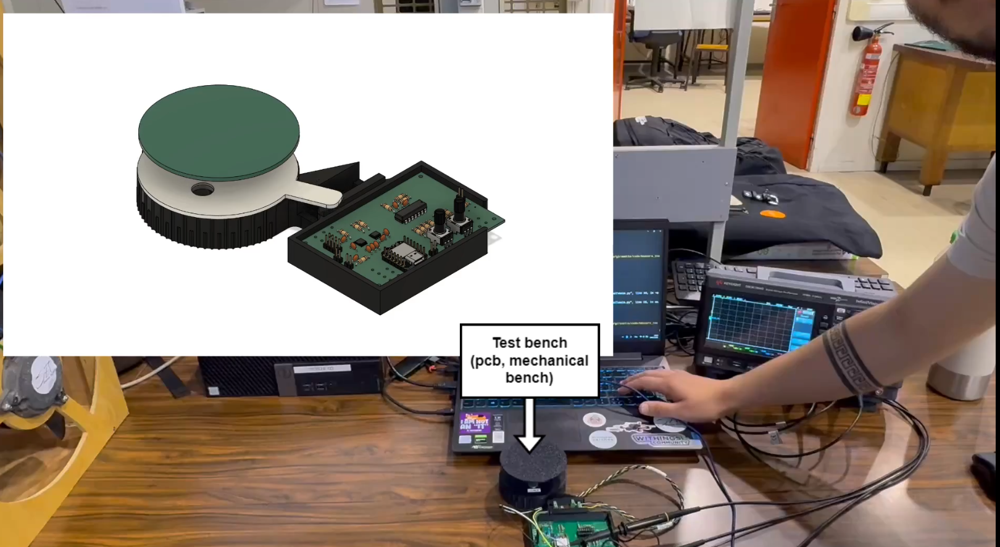
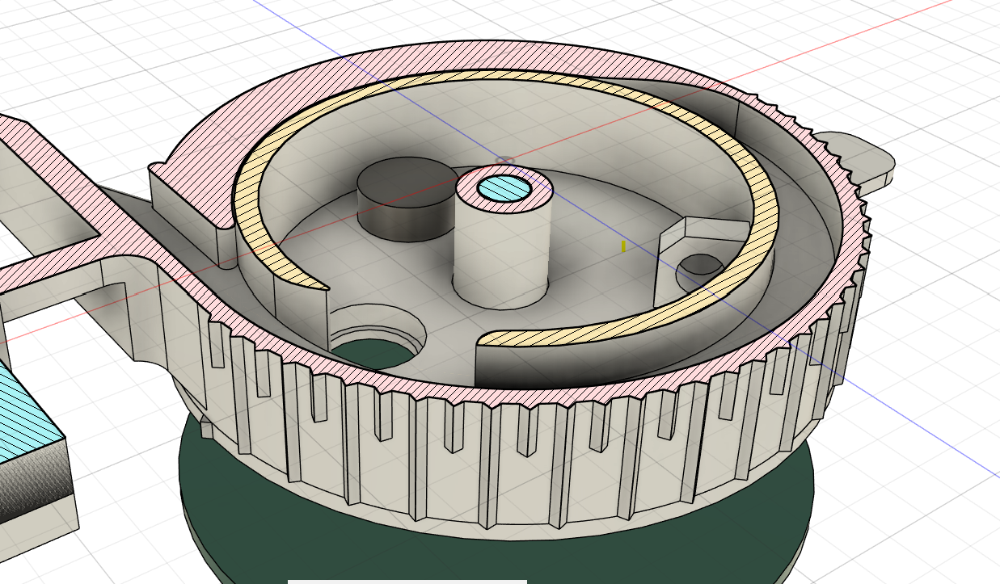
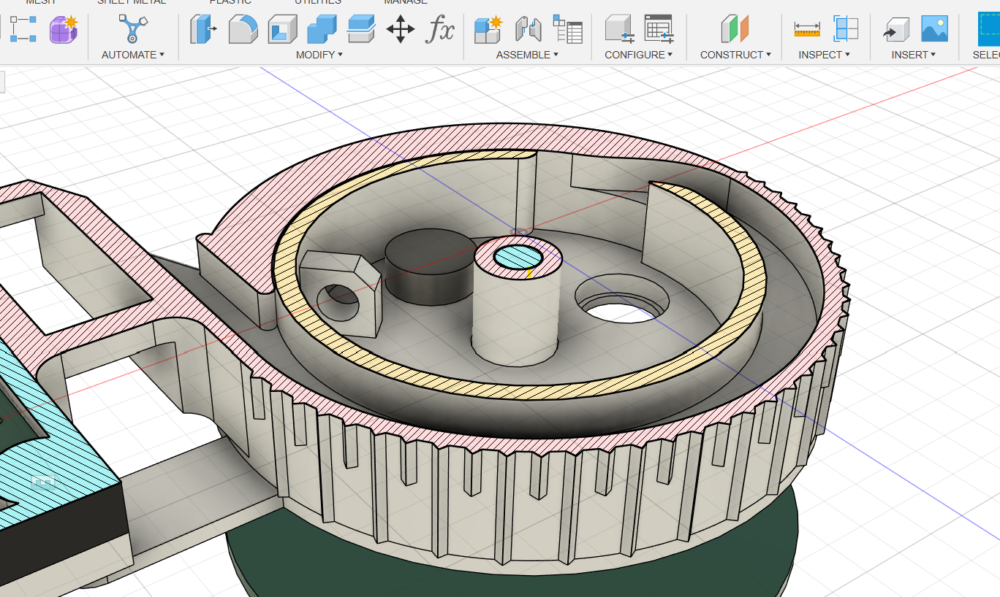

:toc:

= Documentation
Kadwalon Lobet, Guillaume de Maricourt.

== Project demonstration
--> link:https://youtu.be/kEfWdj7LG_c[**Full demo available here !! (youtube)**] <--

=== Full video demonstrator
Full prototpye demonstration, showcasing:

- 3D model test bench animation including PCB.
- Live acquisition of data using a Keysight oscilloscope.
- Live display of measured values saved into a csv file.

--> link:../demos/full_demo.mp4[**Full demo available here  !! (embedded in repo)**] <--

=== Clever bench to optimize probe placement and removal
3D bench test with moving sensor without probe wiggling.

- link:../modeling/setup.adoc[Modeling setup file].

== Project description
Project is a waterproof anemometer, low cost and with decent precision (around 1 m/s sensitivity). +
Purpose is to use it on a miniaturized, autonomous sail boat.

== Repo architecture and setups documentation
This repo use a simple folder architecture using topic seperated folders. +
Some of the folder implement a ``setup.adoc`` file which help in setting up environment or required tools.

See:

- link:../modeling/setup.adoc[Modeling setup file].
- link:../code/setup.adoc[Code setup file].
- link:../pcb/setup.adoc[PCB setup file].

== Project guidelines

In order to submit modification, you will need to submit pull requests and wait for approval. +
Submitted content must follow the architecture.

When submitting a pull request, ensure that:

* All CAO files __(either modeling or pcb)__ are up-to-date, especially for modeling:
** Print files ``.stl or .3mf``
** Project files ``.f3z or .f3d``
* Code is formatted correctyly using ``uncrustify`` see this link:../code/setup.adoc[document] to setup.
* Ensure that your branch is aligned with main (``git fetch | git rebase origin main``)
* Commits follow link:https://www.conventionalcommits.org/en/v1.0.0/[conventionnal commits specification].
* Components datasheets are up-to-date and stored according to PCB project name.

NOTE: ``docs/old`` folder is the first draft of a calibration tools. Goals was to assess impact of anemometer relative angle compared to wind plane. This project has been on hold since teachers wanted to make the actual anemometer and not rely on the industrial one. +
However those documents could be useful in the future and hence are kept.